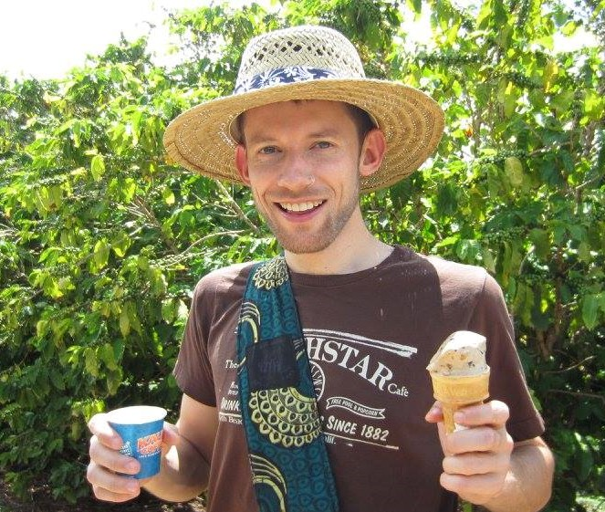
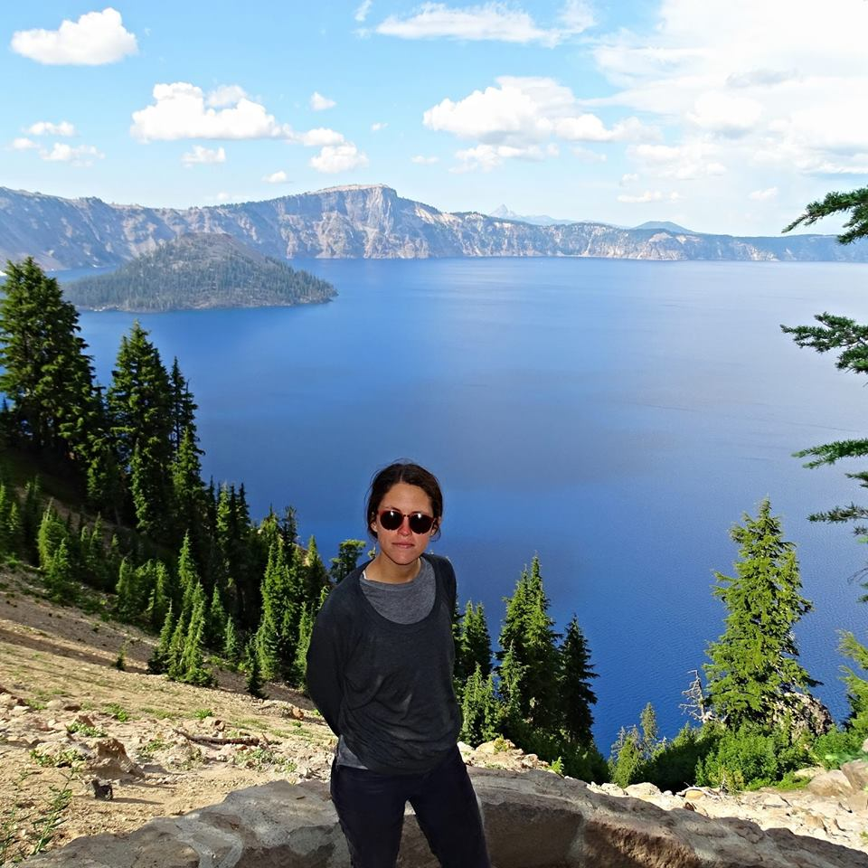
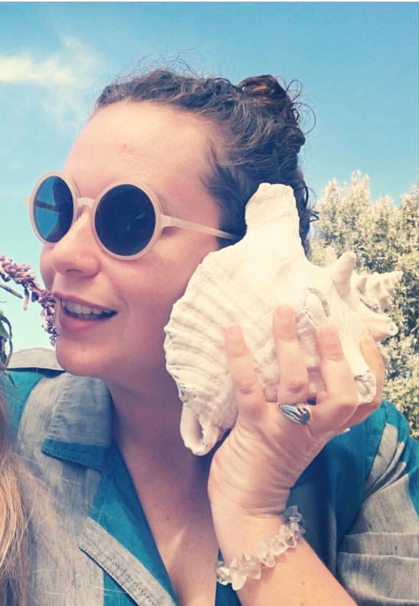
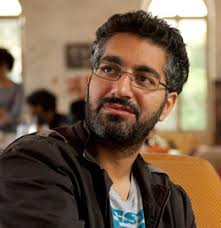

# About
The Queer Ecologies Research Cluster meets every other week to investigate how sexuality and concepts of nature have been historically linked. In particular, we are interested in how evolutionary and ecological science has informed what is “natural” and how we use this information to delineate certain sexual behaviors as normal or aberrant. Queer Ecologies seeks to examine the historical making of the natural as it relates to sexuality while communicating the overwhelming diversity of sex and gender in biology.
  
# Upcoming Events

[{{ post.title }}]({{post.url}})
{{ post.content }}

# People 

 
 

# Meetings

#### 04/2019
- Our next meeting will be the week of April 8, 2019. 

#### 01/09/2019
- Organizing Queer Film Series 

#### 11/12/2018
- Meet and Greet 
- 2018/2019 Planning and Vision

#### 05/2018 
- Roy, Deboleena. "Neuroscience and Feminist Theory: A New Directions Essay." Signs: Journal of Women in Culture and Society 41.3 (2016): 531-552. 

#### 2/16/17 
- Alaimo, Stacy. "Eluding capture: The science, culture, and pleasure of 'queer' animals." Queer ecologies: Sex, nature, politics, desire (2010): 51-72. 

#### 11/29/16 
- Wynter, Sylvia, Mercedes Durán-Cogan, and Antonio Gómez-Moriana. "Towards the Sociogenic Principle: Fanon, The Puzzle of Conscious Experience , of 'Identity' and What it's Like to be 'Black'." National Identity and Socio Political Change: Latin America Between Marginalisation and Integration (1999) . 
- Fanon, Frantz. "1 The Fact of Blackness." Postcolonial Studies: An Anthology (2015): 15. 

#### 11/17/16 
- Luciano, Dana, and Mel Y. Chen. "Introduction: Has the Queer Ever Been Human?." GLQ: A Journal of Lesbian and Gay Studies 21.2 (2015): iv-207. Dossier, The orizing Queer Inhumaninms 
-Muñoz, José Esteban. "Theorizing Queer Inhumanisms: The Sense of Brownness." GLQ: a journal of lesbian and gay studies 21.2 (2015): 209-210. 
- Ahuja, Neel. "Intimate Atmospheres Queer Theory in a Time of Extinctions." GLQ: A Journal of Lesbian and Gay Studies 21.2-3 (2015): 365-385. 

#### 10/27/16 
- McWhorter, Ladelle. "Enemy of the Species." Queer Ecologies: Sex, Nature, Politics, Desire (2010): 73-101. 

